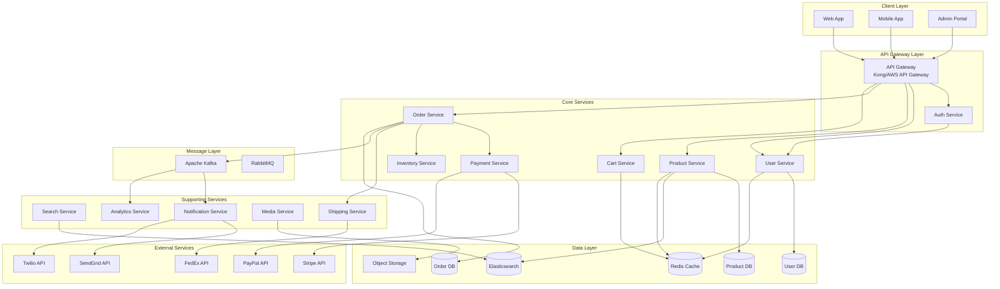
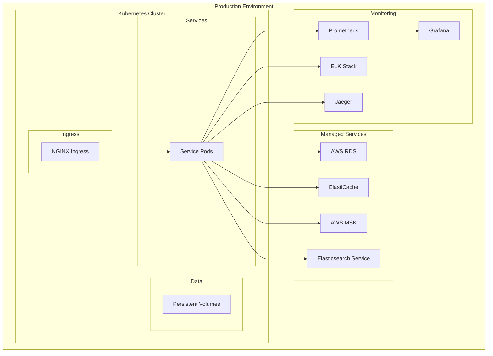

# E-Commerce Microservices Architecture Overview

## Executive Summary

This document outlines a scalable, secure, and modular microservices architecture for a modern e-commerce platform. The architecture follows cloud-native principles with emphasis on resilience, scalability, and maintainability.

## Architecture Principles

1. **Domain-Driven Design**: Services aligned with business domains
2. **API-First**: All services expose well-defined APIs
3. **Event-Driven**: Asynchronous communication for loose coupling
4. **Cloud-Native**: Container-based, orchestrated with Kubernetes
5. **Security by Design**: Zero-trust architecture with mTLS
6. **Observable**: Comprehensive monitoring and tracing

## High-Level Architecture

## Service Descriptions

### Core Services

#### 1. User Service
- **Responsibility**: User management, authentication, authorization
- **Technology**: Node.js/Express or Java/Spring Boot
- **Database**: PostgreSQL with read replicas
- **Key Features**:
  - User registration and profile management
  - OAuth2/JWT token generation
  - Role-based access control (RBAC)
  - Social login integration

#### 2. Product Service
- **Responsibility**: Product catalog management
- **Technology**: Python/FastAPI or Java/Spring Boot
- **Database**: PostgreSQL + Elasticsearch
- **Key Features**:
  - Product CRUD operations
  - Category and attribute management
  - Product search and filtering
  - Bulk import/export

#### 3. Order Service
- **Responsibility**: Order lifecycle management
- **Technology**: Java/Spring Boot or Go
- **Database**: PostgreSQL with event sourcing
- **Key Features**:
  - Order creation and tracking
  - Order state management
  - Integration with payment and shipping
  - Order history and invoicing

#### 4. Payment Service
- **Responsibility**: Payment processing and reconciliation
- **Technology**: Java/Spring Boot (PCI compliant)
- **Database**: PostgreSQL with encryption
- **Key Features**:
  - Multiple payment gateway integration
  - Payment tokenization
  - Refund processing
  - Payment reconciliation

#### 5. Cart Service
- **Responsibility**: Shopping cart management
- **Technology**: Node.js/Express or Go
- **Database**: Redis for session storage
- **Key Features**:
  - Cart persistence
  - Guest cart support
  - Cart merge on login
  - Abandoned cart tracking

#### 6. Inventory Service
- **Responsibility**: Stock management
- **Technology**: Go or Java/Spring Boot
- **Database**: PostgreSQL
- **Key Features**:
  - Real-time inventory tracking
  - Stock reservation
  - Low stock alerts
  - Multi-warehouse support

### Supporting Services

#### 7. Search Service
- **Responsibility**: Product search and discovery
- **Technology**: Python/FastAPI
- **Database**: Elasticsearch
- **Key Features**:
  - Full-text search
  - Faceted search
  - Search suggestions
  - Personalized results

#### 8. Notification Service
- **Responsibility**: Multi-channel notifications
- **Technology**: Node.js/Express
- **Database**: MongoDB for templates
- **Key Features**:
  - Email notifications
  - SMS notifications
  - Push notifications
  - Notification preferences

#### 9. Analytics Service
- **Responsibility**: Business intelligence
- **Technology**: Python/Apache Spark
- **Database**: ClickHouse/BigQuery
- **Key Features**:
  - Real-time analytics
  - Sales reports
  - User behavior tracking
  - A/B testing support

#### 10. Media Service
- **Responsibility**: Image and video management
- **Technology**: Node.js/Express
- **Storage**: S3-compatible object storage
- **Key Features**:
  - Image upload and processing
  - CDN integration
  - Image optimization
  - Thumbnail generation

## Communication Patterns

### Synchronous Communication
- REST APIs for client-service communication
- gRPC for inter-service communication
- Circuit breakers for resilience

### Asynchronous Communication
- Apache Kafka for event streaming
- RabbitMQ for task queues
- Event sourcing for audit trails

## Data Management

### Database Strategy
- **Polyglot Persistence**: Each service owns its database
- **CQRS**: Separate read and write models where applicable
- **Event Sourcing**: For order and payment services
- **Caching**: Redis for session and frequently accessed data

### Data Consistency
- **Eventual Consistency**: For non-critical updates
- **Saga Pattern**: For distributed transactions
- **Outbox Pattern**: For reliable event publishing

## Deployment Architecture

## Scalability Considerations

1. **Horizontal Scaling**: All services designed for horizontal scaling
2. **Auto-scaling**: Based on CPU, memory, and custom metrics
3. **Load Balancing**: Service mesh with Istio
4. **Caching Strategy**: Multi-level caching (CDN, API Gateway, Application, Database)
5. **Database Sharding**: For user and order data

## Security Architecture

1. **Zero Trust Network**: All communication encrypted with mTLS
2. **API Security**: OAuth2 with JWT tokens
3. **Secret Management**: HashiCorp Vault or AWS Secrets Manager
4. **Compliance**: PCI DSS for payments, GDPR for data privacy

## Monitoring and Observability

1. **Metrics**: Prometheus + Grafana
2. **Logging**: ELK Stack (Elasticsearch, Logstash, Kibana)
3. **Tracing**: Jaeger for distributed tracing
4. **Alerting**: PagerDuty integration

## Disaster Recovery

1. **Backup Strategy**: Automated daily backups with point-in-time recovery
2. **Multi-region**: Active-passive setup for disaster recovery
3. **RTO/RPO**: 1 hour RTO, 15 minutes RPO
4. **Chaos Engineering**: Regular failure testing