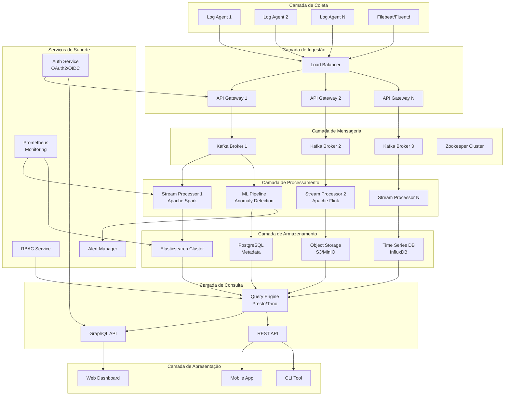
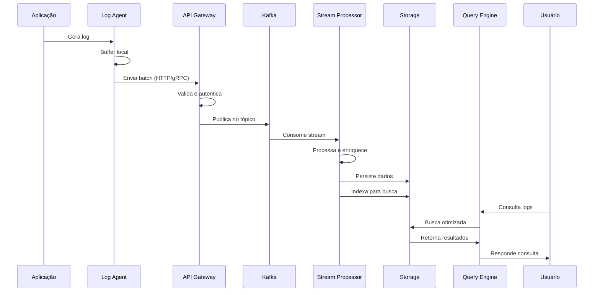

# Sistema de Análise de Logs Distribuído - Visão Geral da Arquitetura

## 📋 Resumo Executivo

Sistema de análise de logs distribuído projetado para processar, armazenar e analisar grandes volumes de logs em tempo real. Arquitetado para escalar horizontalmente e processar mais de 1TB de logs por dia com resposta de consulta em sub-segundos.

## 🏗️ Arquitetura de Alto Nível

## 🔧 Componentes Principais

### 1. Camada de Coleta
- **Log Agents**: Agentes leves instalados nos servidores de origem
- **Filebeat/Fluentd**: Coletores de logs com buffer local
- **Características**:
  - Buffer local para resiliência
  - Compressão antes do envio
  - Retry automático com backoff exponencial
  - Suporte a múltiplos formatos de log

### 2. Camada de Ingestão
- **Load Balancer**: Distribuição de carga entre gateways
- **API Gateway**: Endpoints HTTP/gRPC para recepção de logs
- **Características**:
  - Rate limiting por cliente
  - Validação de schema
  - Autenticação via API keys
  - Métricas de ingestão em tempo real

### 3. Camada de Mensageria
- **Apache Kafka**: Sistema de mensageria distribuído
- **Zookeeper**: Coordenação do cluster Kafka
- **Características**:
  - Particionamento por tipo de log
  - Retenção configurável (7-30 dias)
  - Replicação para alta disponibilidade
  - Compactação de tópicos

### 4. Camada de Processamento
- **Apache Spark/Flink**: Processamento em stream
- **ML Pipeline**: Detecção de anomalias e padrões
- **Características**:
  - Processamento em tempo real e batch
  - Agregações e transformações
  - Enriquecimento de dados
  - Detecção de anomalias via ML

### 5. Camada de Armazenamento
- **Elasticsearch**: Busca e análise em tempo real
- **Object Storage**: Arquivamento de longo prazo
- **Time Series DB**: Métricas e séries temporais
- **PostgreSQL**: Metadados e configurações
- **Características**:
  - Indexação otimizada por tipo de log
  - Compressão e deduplicação
  - Lifecycle policies para dados antigos
  - Backup automático

### 6. Camada de Consulta
- **Query Engine**: Presto/Trino para consultas federadas
- **GraphQL API**: Interface flexível para frontend
- **REST API**: Compatibilidade com ferramentas existentes
- **Características**:
  - Cache distribuído (Redis)
  - Query optimization
  - Paginação eficiente
  - Suporte a consultas complexas

### 7. Camada de Apresentação
- **Web Dashboard**: Interface rica em React
- **Mobile App**: Aplicativo React Native
- **CLI Tool**: Ferramenta de linha de comando
- **Características**:
  - Visualizações em tempo real
  - Dashboards customizáveis
  - Alertas e notificações
  - Export de dados

### 8. Serviços de Suporte
- **Auth Service**: Autenticação centralizada
- **RBAC Service**: Controle de acesso granular
- **Alert Manager**: Sistema de alertas
- **Monitoring**: Observabilidade do sistema

## 📊 Fluxo de Dados

## 🚀 Características de Escalabilidade

### Escala Horizontal
- **Auto-scaling**: Baseado em CPU/memória/throughput
- **Sharding**: Distribuição por timestamp e tipo de log
- **Load Balancing**: Distribuição inteligente de carga
- **Replicação**: Múltiplas réplicas para HA

### Performance
- **Ingestão**: 100k+ logs/segundo por nó
- **Latência**: < 100ms para ingestão
- **Query**: < 1s para consultas complexas
- **Storage**: Compressão 10:1

### Alta Disponibilidade
- **Multi-AZ**: Distribuição entre zonas
- **Failover**: Automático com < 30s RTO
- **Backup**: Snapshots incrementais
- **DR**: Replicação cross-region

## 🔒 Arquitetura de Segurança

### Autenticação e Autorização
- **OAuth2/OIDC**: Para aplicações web
- **API Keys**: Para agentes e serviços
- **mTLS**: Entre componentes internos
- **RBAC**: Controle granular de acesso

### Criptografia
- **Em Trânsito**: TLS 1.3 em todas as comunicações
- **Em Repouso**: AES-256 para dados sensíveis
- **Key Management**: Integração com KMS
- **Secrets**: Vault/Kubernetes Secrets

### Compliance
- **Audit Logs**: Todas as operações registradas
- **Data Retention**: Políticas configuráveis
- **GDPR**: Suporte a direito ao esquecimento
- **SOC2**: Controles implementados

## 🔧 Tecnologias Utilizadas

### Core
- **Linguagens**: Go (agents), Java (processamento), Python (ML), TypeScript (frontend)
- **Frameworks**: Spring Boot, FastAPI, React, Next.js
- **Mensageria**: Apache Kafka 3.x
- **Processamento**: Apache Spark 3.x, Flink 1.15+

### Storage
- **Elasticsearch**: 8.x para busca
- **PostgreSQL**: 15+ para metadados
- **S3/MinIO**: Object storage
- **Redis**: 7.x para cache

### Infraestrutura
- **Kubernetes**: 1.27+ para orquestração
- **Istio**: Service mesh
- **Terraform**: IaC
- **ArgoCD**: GitOps

### Observabilidade
- **Prometheus**: Métricas
- **Grafana**: Visualização
- **Jaeger**: Distributed tracing
- **ELK**: Logs do próprio sistema

## 📈 Requisitos de Recursos

### Mínimo (Dev/Test)
- **Nodes**: 5 (3 master, 2 worker)
- **CPU**: 32 cores total
- **RAM**: 128GB total
- **Storage**: 2TB SSD

### Produção (1TB/dia)
- **Nodes**: 20+ (3 master, 17+ worker)
- **CPU**: 200+ cores total
- **RAM**: 800GB+ total
- **Storage**: 50TB+ (com retenção de 30 dias)

### Network
- **Bandwidth**: 10Gbps entre nós
- **Latency**: < 5ms intra-cluster
- **Egress**: Calculado por volume de consultas

## 🔄 Próximos Passos

1. **Detalhamento de APIs**: Especificações OpenAPI/AsyncAPI
2. **Modelos de Dados**: Schemas e estruturas
3. **Plano de Implementação**: Fases e marcos
4. **POC**: Proof of concept com componentes core
5. **Testes de Carga**: Validação de escalabilidade